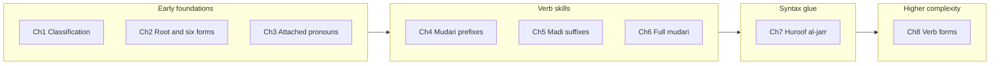

# Syllabus review: intro vs chapters and improvement suggestions

## How your stated purpose maps to what you built

From [intro.md](F:/quran/intro.md), the course aims to help people who can **read** the Arabic Quran move toward **understanding without translation**, using a **root/pattern** approach, with **difficulty rising slowly** so less confident learners retain value before topics get hard.

The **implemented syllabus** (source of truth for navigation and the home page grid) is in [course-data.js](F:/quran/course-data.js):

| Order | Title (as shipped) | Role in the arc |
|------:|--------------------|------------------|
| 1 | Word Classification | Foundational lens (Ism / Fi‘l / Ḥarf) |
| 2 | The Root (جذر) + “6 basic forms” | Pattern DNA; previews past/present/command and doer/receiver |
| 3 | Pronouns (الضمير), attached | Suffix “connectors” on words |
| 4 | Present Subject (مضارع) | **Prefixes only** — Yatan rule |
| 5 | Past Verbs (ماضي) | Suffix person markers on past |
| 6 | Present Verbs (مضارع) | **Full present conjugation** (prefixes + suffixes) |
| 7 | Prepositions (حروف الجر) | Kasra/jarr; glue between phrases |
| 8 | Verb Forms (أوزان) | Higher abstraction — “families” beyond Form I |

This order is **reasonable for your goal**: learners meet **suffix pronouns** before full verb tables, get a **light مضارع** (prefixes) before **ماضي**, then return to **full مضارع**. Ending with **أوزان** matches “complexity increases later.”

---

## Critical doc mismatch (not a “remove chapter” issue)

[intro.md](F:/quran/intro.md) is **out of date** vs the app:

- It lists **5** chapters; you ship **8** (`chapter1.html` … `chapter8.html`).
- It says **“5 Basic Forms”**; [chapter2.html](F:/quran/chapter2.html) correctly teaches **six** states (including **مصدر** and the قياسي vs سماعي note).
- It places **Mudari & Yatan before pronouns**; the product order is **pronouns → then مضارع prefixes → ماضي → full مضارع**.

**Suggestion:** Treat `intro.md` as a **syllabus spec** and refresh it to mirror [course-data.js](F:/quran/course-data.js) (or generate one from the other so they cannot drift). The polished copy already lives on [index.html](F:/quran/index.html) (“About the Course”); the intro file should match that story.

Minor: fix typos in the intro (“objective **if**”, “**Folowing**”, “**throught**”, “**intented**”) when you edit.

---

## Chapters to remove?

**Do not remove** Ch1–Ch7 for your stated audience; they are lean and cumulative.

**Chapter 8 (Verb forms / أوزان):** still aligned with “root method,” but it is the first **big conceptual jump**. Options that fit your “people may drop when it gets hard” principle:

- **Keep** as Ch8 but label it clearly as **“Level 2” / “Stretch”** on the home card and at the top of the chapter, so completion of Ch1–7 still feels like a **complete beginner arc**.
- **Do not remove** unless you move it to a separate “appendix” course; removing it would weaken the “root upgrades meaning” promise for motivated learners.

---

## Chapters to add (highest leverage for “understand the Quran”)

Your current track is **strong on morphology** (who did what, patterns, jar). For **sentence-level meaning**, most learners still need a **small syntax layer** before or alongside heavy verb tables. Suggested **new chapters** (order can be debated; rough difficulty in parentheses):

1. **Nominal sentences (جملة اسمية)** — مبتدأ + خبر, simple questions, “Allah is … / the Book is …”. Very high frequency; low formal machinery if you avoid full إعراب at first. **(Low–medium)**

2. **Verbal sentences (جملة فعلية)** — verb–subject word order defaults, فاعل when explicit. Bridges Ch5–6 to real ayah shape. **(Medium)**

3. **Minimal “cases” for reading** — not a full إعراب course: just **رفع / نصب / جر** as **ending patterns** on the most common word types, tying **جر** to Ch7. **(Medium)**

4. **High-frequency ḥarf cluster** beyond prepositions — e.g. **لَمْ**, **لَنْ**, **لَا النافية للجنس**, **إنَّ وأخواتها** in a **pattern-only** way (what changes on the next word). Huge ROI in Quranic text. **(Medium–high)**

5. **Idāfa (إضافة)** — “X of Y” structure; unlocks many noun phrases. **(Low–medium)**

Optional later: **ما / لا النافية للجنس**, weak verb quirks as **spot patterns**, not exhaustive rules.

You do **not** need all of these at once; for your philosophy, **1 + 5** (nominal sentences + idāfa) after Ch3 or after Ch7 often gives the biggest “I can parse an ayah” win without exploding length.

---

## Modifications inside existing chapters (quality / clarity)

1. **Ch4 vs Ch6 naming overlap:** Both use “مضارع” in titles/descriptions. Ch4 is really **“Mudari prefixes / subject markers (Yatan)”**; Ch6 is **“Full mudari conjugation (تصريف).”** Renaming or subtitles in [course-data.js](F:/quran/course-data.js) and matching H1s would reduce “didn’t we already do present?” fatigue.

2. **Chapter 5 intro copy:** The bullet *“Unlike Chapter 4, these tell us the Subject (Hero), not the object”* in [chapter5.html](F:/quran/chapter5.html) is **misleading** — Ch4 is also about **subject** (who acts), only on **present prefixes** vs Ch5’s **past suffixes**. Prefer contrast: **past vs present** and **suffix vs prefix**, not subject vs object.

3. **Terminology consistency:** Intro uses **Huroof**; Ch1 body uses **Harf** in places — pick one pedagogical spelling (e.g. Ḥarf / Huroof al-jarr only where “particles” as a class).

4. **Repo hygiene:** [chapter5_v14.html](F:/quran/chapter5_v14.html) and [old_chapter2.html](F:/quran/old_chapter2.html) look like **drafts**; if unused by [main.js](F:/quran/main.js), archive or delete to avoid teaching from the wrong file by mistake.

5. **Excel temp file:** `~$arabic 10 verb forms.xlsx` is an Office lock/temp file — exclude from git / delete locally.

---

## Summary recommendation

- **Align** [intro.md](F:/quran/intro.md) with the **8-chapter** product and the **6-form** Ch2 model; fix typos.
- **Keep** the current chapter set; **frame Ch8** as advanced/stretch if you want a gentler psychological off-ramp.
- **Add** 1–2 **syntax** chapters (nominal sentence + idāfa first) when you extend the course; they serve your “understand without translation” goal more than another morphology drill.
- **Tweak** Ch4/Ch6 titles and Ch5’s misleading bullet; clean obsolete HTML copies.

No blocking questions from the repo; if you want a strict **single linear path** vs **core + elective** tracks, that is mainly a UX/content packaging choice for a later iteration.
