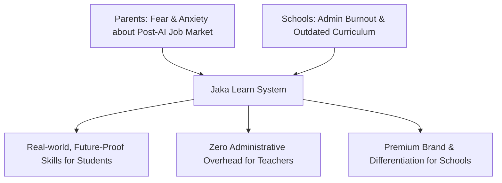

# 🚀 Jaka Learn: Strategic Learning & Pitch Plan

**Vision:** A world where schools produce capable minds with the skills and knowledge needed to thrive in the new AI era.

**Mission:** To provide schools with a complete system of technology and practical learning that equips students with real-world skills—enabling them to secure top modern careers, lead great businesses, and create their own global opportunities.

---

## 🎯 High-Impact Pitch Hooks

These framing strategies target specific, high-urgency pain points. Use them in pitch decks, marketing copy, and sales conversations to instantly capture attention.

### 🛑 Category 1: What Keeps Parents Awake at Night?
*Focus: Anxiety regarding their child's future, employability, and cognitive capability in an AI-driven world.*

| Hook / Pain Point | Description & Pitch Angle |
| :--- | :--- |
| **💼 The "Degree without a Job" Crisis** | Parents invest heavily in school fees and coaching, yet nearly half of all graduates remain unemployable. The old formula (**memorize → score high → get a job**) is broken because companies hire for skills, not mark sheets. |
| **🤖 The Post-AI Panic** | Parents fear that entry-level white-collar and corporate jobs will be automated before their child graduates. They want their children to be irreplaceable but don't know what to teach them. |
| **🧠 The "Cognitive Off-Loading" Trap** | Easy access to AI shortcuts is eroding students' ability to think independently. Parents observe their children becoming screen-dependent and losing core critical thinking, research, and problem-solving skills. |
| **🧗 The Fear of a One-Track Mind** | Extreme pressure from competitive exams leaves parents anxious that a single failure will ruin their child's future. They want self-reliant children capable of building businesses or finding global opportunities. |

---

### 🏫 Category 2: What Stresses School Management?
*Focus: Operational bottlenecks, competitive differentiation, and the pressure to appear modern/premium.*

| Hook / Pain Point | Description & Pitch Angle |
| :--- | :--- |
| **🏷️ The Rote-Learning Stigma** | Progressive schools strive to market themselves as modern, yet their curriculum remains stuck in the 1990s (textbook memorization). They risk losing enrollment to newer, "alternative" or international institutions. |
| **⏳ Teacher Burnout & Administrative Drown** | Teachers spend up to 40% of their time on repetitive tasks, data entry, compliance, and report cards instead of active teaching, causing fatigue and retention issues. |
| **🖥️ The "Tech for Show" Problem** | Most schools invest in smartboards and computer labs for aesthetic appeal, but lack a structured system or syllabus to teach real-world future skills like AI prompt engineering, entrepreneurship, or financial literacy. |
| **🛡️ The AI Policy Vacuum** | Administration knows students use AI to cheat on homework, but lacks a complete framework to transform AI from a cheating tool into a structured learning assistant. |

---

## 🌉 The Bridge: The Jaka Learn Value Proposition

Parents are demanding future-proof education, and schools are struggling to deliver it. **Jaka Learn bridges this gap.**

### 💫 The Triple-Win Delivery:
1. **For Students:** Unlocks real-world, future-proof skills that help them build businesses, secure modern careers, and stand out globally.
2. **For Schools:** Offers a plug-and-play technology and educational system that upgrades their curriculum effortlessly, enhancing their brand value.
3. **For Teachers:** Automates administrative tasks, freeing up to 40% of their time so they can focus on high-impact mentoring.